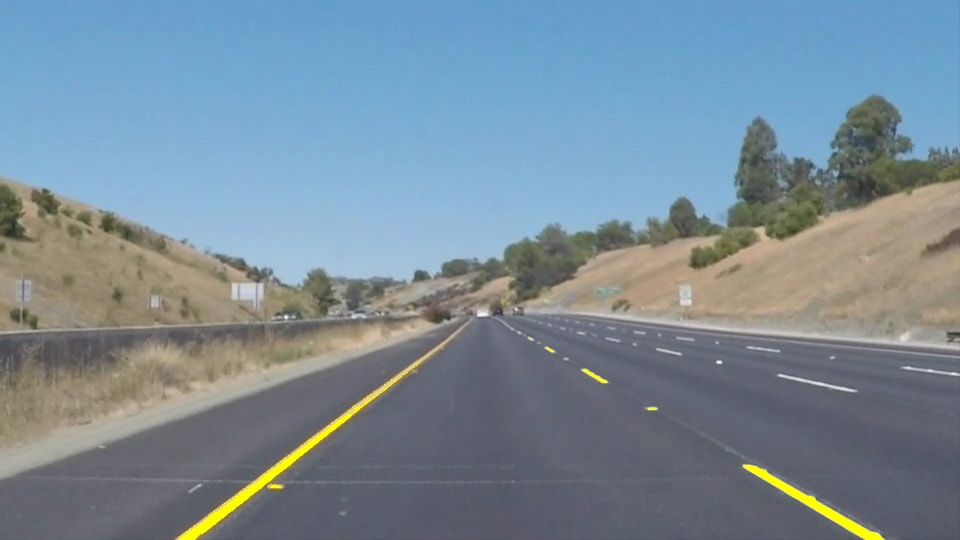

# **Finding Lane Lines on the Road** 

## Writeup - J. Zhao

### 2019/09/17

---

**Finding Lane Lines on the Road**

The goals / steps of this project are the following:
* Make a pipeline that finds lane lines on the road
* Improve the pipeline to fit for the challenge
* Reflect on the work

---

### Reflection

### 1. Description of pipeline

The created pipeline consisted of 4 steps as follows (with example below):

	
	

1. Color `aug`mentation in interested area (easier for step 3 when lane lines are under the shadow - in challenge.mp4).

	
	

2. Turn the rgb image to `grayscale`.

	
	

3. Apply `canny` edge detection.

	
	

4. Perform `hough_lines` transform in interested area then draw lane lines on the basis of detected line segments.

	
	

The `draw_lines` function is modified in order to draw a single line on the left and right lanes.

1. the line segments are filtered by their **slope (y1-y2)/(x1-x2)**, some incorrect lines are discarded.

2. the line segments are sorted to left lines and right lines also by their slope, and their mid point is calculated.

3. calculate the average mid point of left line and right line.

4. derive the starting point and ending point of left and right line and draw them on the image.

### 2. Potential shortcomings with current pipeline

The potential shortcoming would be deviation of lane lines when some disturbing lines such as shadow/road face color... 
with similar slope as actual lane lines shows up.

Another potential shortcoming would be unable of detect lane line when the actual lane line segment is too short to
achieve the hough transform threshold (in some frames of challenge.mp4).

### 3. Possible improvements

A possible improvement would be to keep tracking the central line between the two lane lines, when one of the lane lines
is shifted or undetected, it can be rectified or predicted with the cached central line.
